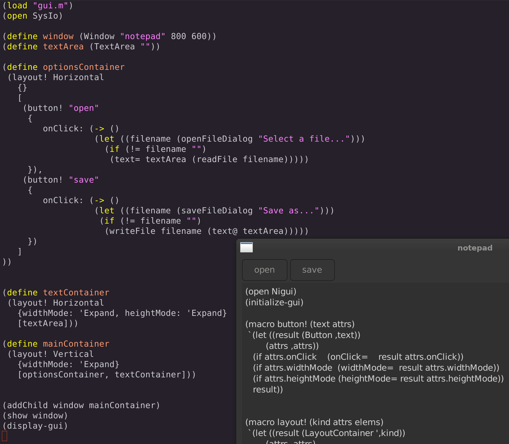
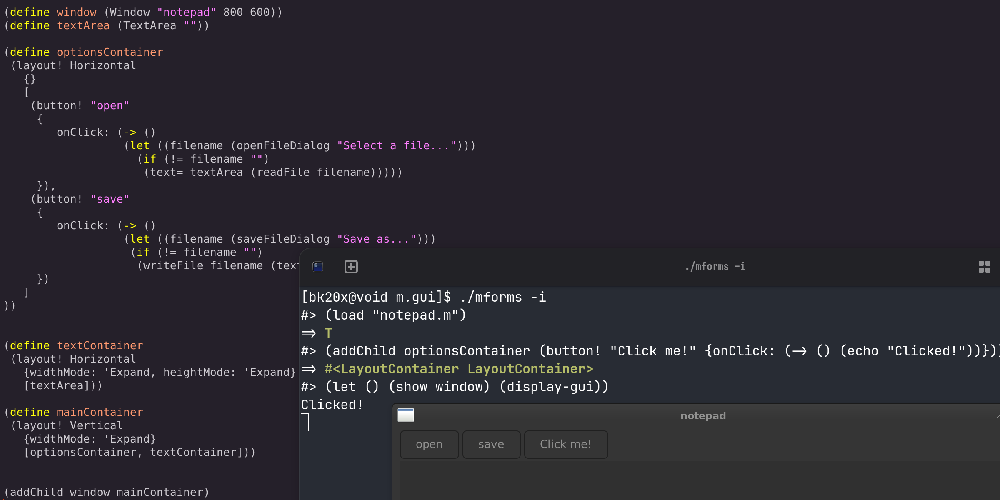

# M forms
#### The output of compiling mforms.nim is a standalone M interpreter with the bindings registered as Builtins that you can use or register your own builtins in that file.
#### This repository will also contain a usermode library on top of the builtins for expressivity

- you can live code your gui, just make sure to call (initialize-gui) and redefine your window after closing it

